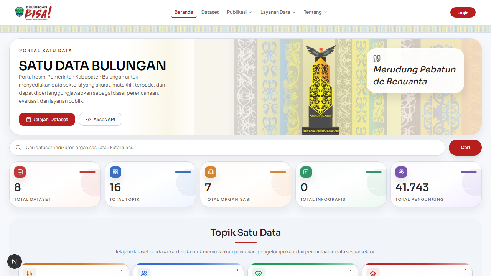
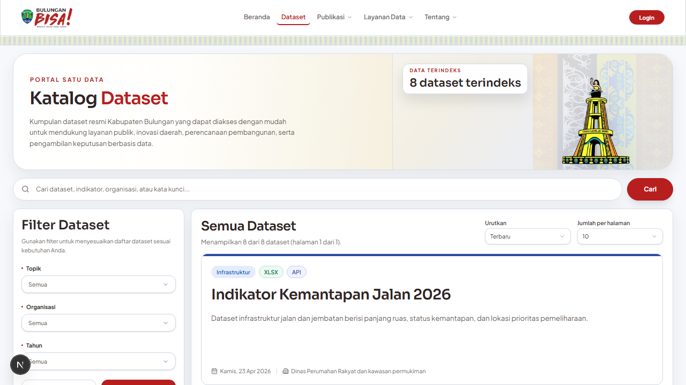
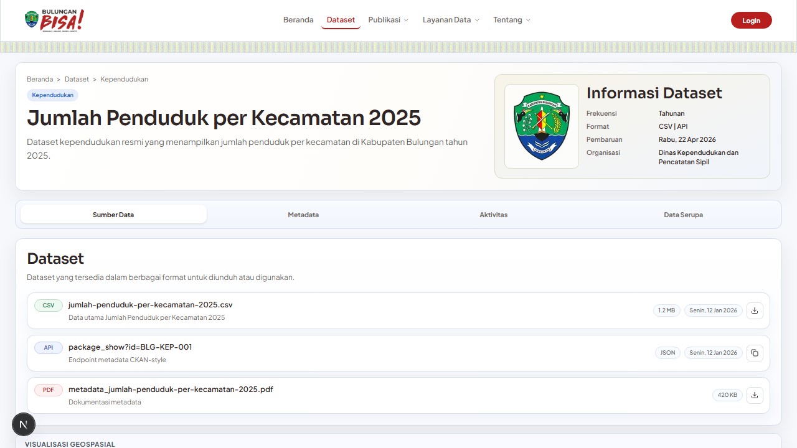
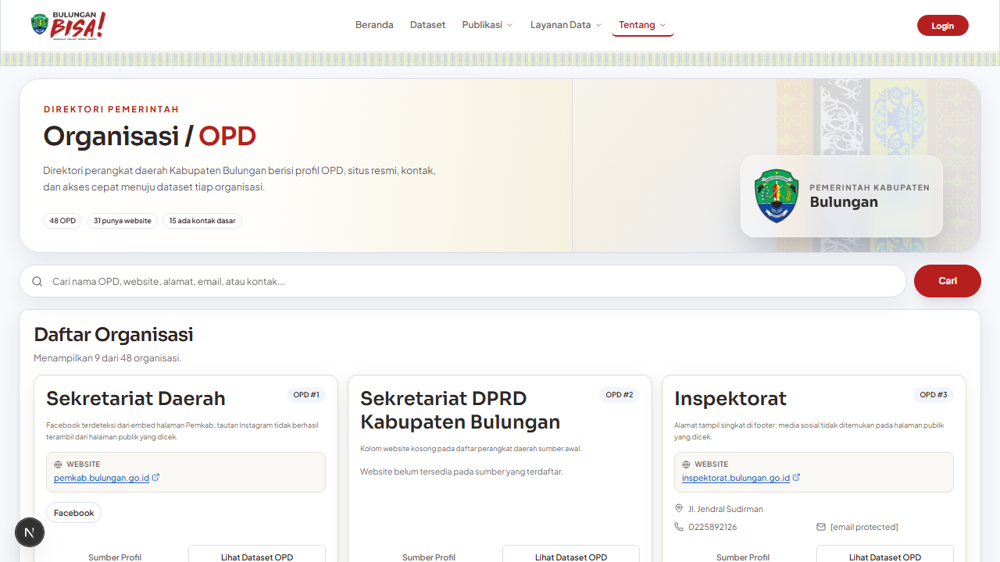
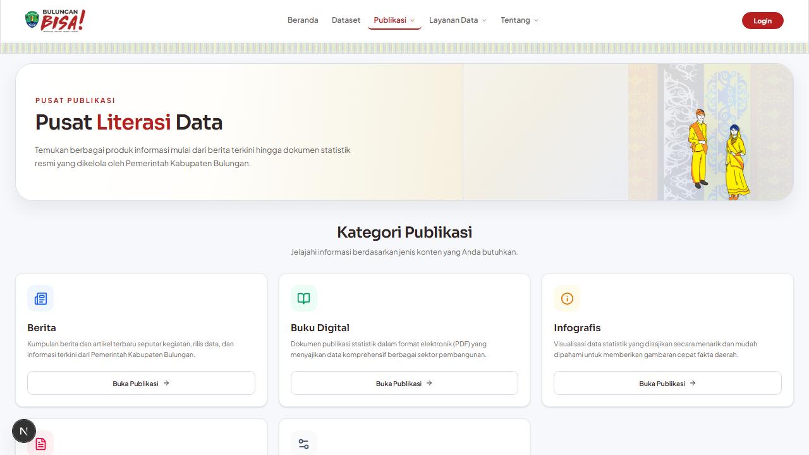
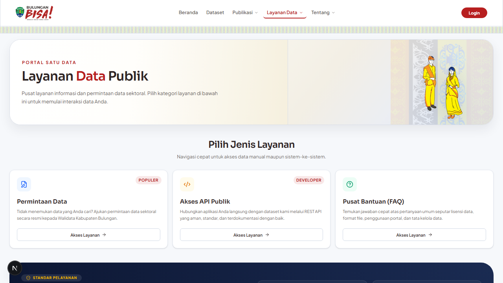
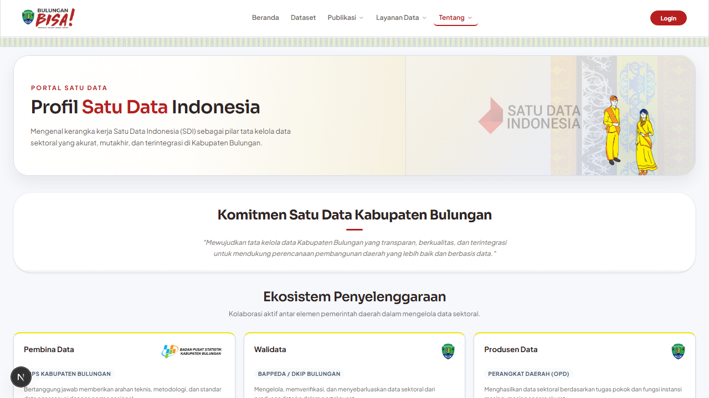
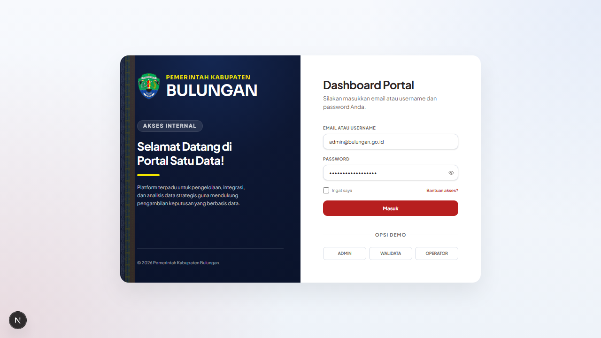

# Satu Data Bulungan

Portal Satu Data Bulungan adalah aplikasi portal data terpadu untuk Pemerintah Kabupaten Bulungan. Aplikasi ini dirancang untuk mempublikasikan data sektoral, memberikan akses publik terhadap dataset, serta menyediakan manajemen data (workflow, persetujuan, dan pengelolaan) bagi internal pemerintah daerah.

## Overview

Satu Data Bulungan dibangun dengan arsitektur modern menggunakan Next.js untuk frontend/backend portal, serta terintegrasi dengan CKAN untuk penyimpanan dataset tingkat lanjut.

Aplikasi ini ditujukan untuk:
- **Masyarakat Umum**: Mencari, melihat, dan mengunduh dataset, infografis, dan publikasi daerah secara mudah.
- **Admin & Walidata (BPS/Kominfo)**: Mengelola master data, meninjau pengajuan dataset, dan mengelola pengguna.
- **Operator OPD**: Mengajukan dataset baru, memperbarui data sektoral dari masing-masing instansi.

Nilai utama yang diberikan:
- Akses data yang transparan dan terpusat untuk masyarakat.
- Alur kerja (workflow) pengajuan data yang jelas antara OPD, Walidata, dan Pembina Data.
- Kompatibilitas ganda: berjalan dengan data mock lokal saat pengembangan, dan terintegrasi penuh dengan CKAN di tahap produksi.

## Fitur Utama

- **Portal Publik**: Halaman landing modern, pencarian dataset yang intuitif, visualisasi metadata, dan eksplorasi berdasarkan Topik atau Organisasi.
- **Portal Internal (Dashboard)**: Ruang kerja aman dengan akses role-based (Admin, Walidata, Operator OPD).
- **Manajemen Dataset (Workflow)**: Proses pengajuan (draft), review, revisi, hingga publikasi dataset.
- **Shared Data Layer**: Arsitektur adaptif yang mendukung mock-data (`.local/internal-portal-store.json`) atau backend CKAN secara transparan.
- **Desain Responsif & Modern**: Tampilan responsif di semua perangkat dengan antarmuka yang bersih dan mudah digunakan.

## Preview Aplikasi

### Portal Publik

- **Halaman Utama (Home)**
  
- **Katalog Dataset**
  
- **Detail Dataset**
  
- **Eksplorasi Organisasi**
  
- **Publikasi**
  
- **Layanan Data**
  
- **Tentang**
  

### Portal Internal

- **Login Internal**
  


## Menu Aplikasi

| Menu Publik | Fungsi |
| --- | --- |
| Home (`/`) | Halaman utama portal Satu Data Bulungan. |
| Dataset (`/dataset`) | Katalog seluruh dataset yang tersedia dengan filter dan pencarian. |
| Detail Dataset (`/dataset/[slug]`) | Informasi rinci dataset, metadata, dan opsi unduh resource. |
| Publikasi (`/publikasi`) | Kumpulan dokumen publikasi, regulasi, dan petunjuk teknis. |
| Layanan Data (`/layanan-data`) | Informasi panduan, FAQ, dan form permintaan data. |
| Tentang (`/tentang/profil-sdi`) | Informasi latar belakang dan tujuan portal Satu Data Bulungan. |
| Topik (`/topik`) | Eksplorasi dataset berdasarkan kategori/topik. |
| Organisasi (`/organisasi`) | Eksplorasi dataset berdasarkan produsen data (OPD). |
| API (`/api`) | Endpoint API untuk integrasi sistem eksternal. |

| Menu Internal | Fungsi | Role Akses |
| --- | --- | --- |
| Login (`/internal`) | Gerbang autentikasi internal. | Semua |
| Dashboard (`/internal/dashboard`) | Ringkasan statistik dan notifikasi. | Semua |
| Datasets (`/internal/datasets`) | Daftar dataset yang dikelola oleh pengguna/instansi. | Semua |
| Tambah Dataset (`/internal/datasets/new`) | Form pengajuan dataset baru. | Operator, Walidata, Admin |
| Workflow (`/internal/workflow`) | Manajemen persetujuan dan alur kerja dataset. | Walidata, Admin |
| Users (`/internal/users`) | Manajemen pengguna portal internal. | Admin |
| Organizations (`/internal/organizations`) | Manajemen daftar OPD/Organisasi. | Admin |

## Installation

### 1) Clone repository

```bash
git clone https://github.com/bpskabbulungan/satudatabulungan.git
cd satudatabulungan
```

### 2) Menjalankan Portal (Web)

Portal berjalan menggunakan Next.js di dalam folder `web/`.

```bash
cd web
cp .env.example .env.local
npm install
npm run dev
```

Akses aplikasi:
- Portal Publik: `http://localhost:3000`
- Portal Internal: `http://localhost:3000/internal`

### 3) Menjalankan CKAN Stack (Opsional)

Jika ingin menggunakan backend CKAN lokal:

```bash
# Pastikan Docker berjalan
docker compose up -d

# Uji koneksi CKAN
node scripts/test-ckan-connection.mjs http://localhost:5000

# Bootstrap / Seed data sample ke CKAN
node scripts/ensure-ckan-token.mjs --format powershell
node scripts/seed-ckan-sample.mjs http://localhost:5000
```

## Deploy Docker + Cloudflared (Branch Bersih)

Untuk kebutuhan deploy server yang ringan (tanpa build ulang di server), gunakan pipeline:
- `.github/workflows/build-web-image.yml` -> build + push image web ke GHCR
- `.github/workflows/sync-deploy-branch.yml` -> sinkronisasi branch `deploy`

Langkah operasional:
1. Push perubahan ke branch `main`.
2. Tunggu workflow `Build Web Image` sukses.
3. Di server, clone/pull branch `deploy`.
4. Salin env contoh dan jalankan dengan Docker Compose.

```bash
docker compose --env-file deploy/env/portal.deploy.env -f deploy/docker/docker-compose.portal.yml up -d
```

## Scripts

### Root Project

Skrip ini dijalankan dari root folder `satudatabulungan`.

| Script | Keterangan |
| --- | --- |
| `node scripts/smoke-dual-mode.mjs` | Test integrasi dual-mode (mock vs CKAN). |
| `node scripts/smoke-workflow-api.mjs`| Uji coba API workflow dan verifikasi auth. |
| `.\scripts\sync-opd-excel.ps1` | Sinkronisasi direktori OPD dari file Excel. |

### Web (Frontend & Backend Portal)

Masuk ke direktori `web/` untuk menjalankan skrip berikut.

| Script | Keterangan |
| --- | --- |
| `npm run dev` | Menjalankan server development Next.js. |
| `npm run build` | Build aplikasi untuk production. |
| `npm run start` | Menjalankan aplikasi hasil build. |
| `npm run lint` | Menjalankan ESLint. |
| `npm run test:visual` | Menjalankan visual test. |
| `npm run test:a11y` | Menjalankan uji aksesibilitas dasar. |
| `npm run test:visual:update` | Memperbarui baseline snapshot visual. |

## Struktur Project

```bash
satudatabulungan/
|- docs/               # Audit, blueprint, dokumen acuan, changelog
|  |- images/          # Screenshot dokumentasi (untuk README)
|- references/         # Dokumen referensi dan mockup awal
|- scripts/            # Skrip utilitas, testing, dan seeder
|- services/           # Konfigurasi layanan eksternal (contoh: ckan)
|- web/                # Aplikasi utama (Next.js)
|  |- public/          # Aset statis publik
|  |- src/
|  |  |- app/          # App Router Next.js (publik & internal)
|  |  |- components/   # Komponen UI yang dapat digunakan kembali
|  |  |- lib/          # Utilitas, konfigurasi, dan store data
|- .local/             # Penyimpanan lokal (mock data, mock db)
|- README.md
```
